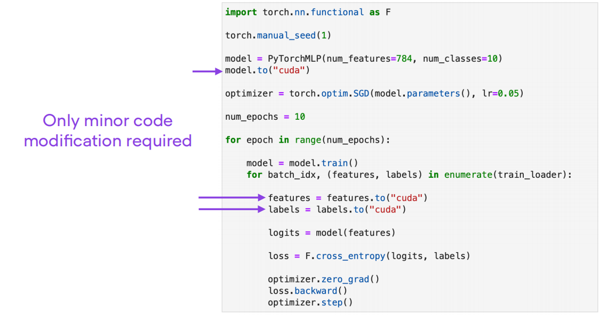

# Installation NVIDIA dependencies

- **NVIDIA:**
    - **[CUDA](https://developer.nvidia.com/cuda-toolkit)**
        - Check installed: `nvcc --version` (preferable) or `nvidia-smi`
    - [**cuDNN**](https://developer.nvidia.com/cudnn)
        - **Windows**: copy the contents of the **`bin`**, **`include`**, and **`lib`** folders from the cuDNN package to the corresponding folders in the CUDA installation directory (usually **`C:\Program Files\NVIDIA GPU Computing Toolkit\CUDA\vX.Y`**, where **`X.Y`** is your CUDA version).
- [**PyTorch**](https://pytorch.org/get-started/locally/)
    - Using **`pip`** corresponding command
- **Checking**
    
    ```python
    import torch
    print(torch.cuda.is_available())
    ```
    
    True means accelerated GPU
    

# PyTorch with GPU

- **Switching between CPU and GPU**
    
    ```python
    import torch
    print(torch.cuda.is_available())
    ```
    
    True
    
    ```python
    my_tensor = torch.tensor([1., 2., 3.])
    my_tensor
    ```
    
    tensor([1., 2., 3.])
    
    ```python
    my_tensor.to('cuda')
    ```
    
    tensor([1., 2., 3.], device='cuda:0')
    
    ```python
    my_tensor.to('cpu')
    ```
    
    tensor([1., 2., 3.])
    
- **Examples of training MLP (MultiLayer Percepton)**
    - With CPU
        
        ```python
        import torch.nn.functional as F
        
        torch.manual_seed(1)
        model = PyTorchMLP(num_features=784, num_classes=10)
        
        optimizer = torch.optim.SGD(model.parameters(), lr=0.05)
        
        num_epochs = 10
        
        loss_list = []
        train_acc_list, val_acc_list = [], []
        for epoch in range(num_epochs):
        
            model = model.train()
            for batch_idx, (features, labels) in enumerate(train_loader):
        
                logits = model(features)
        
                loss = F.cross_entropy(logits, labels)
        
                optimizer.zero_grad()
                loss.backward()
                optimizer.step()
        ```
        
    - With GPU
    
    
